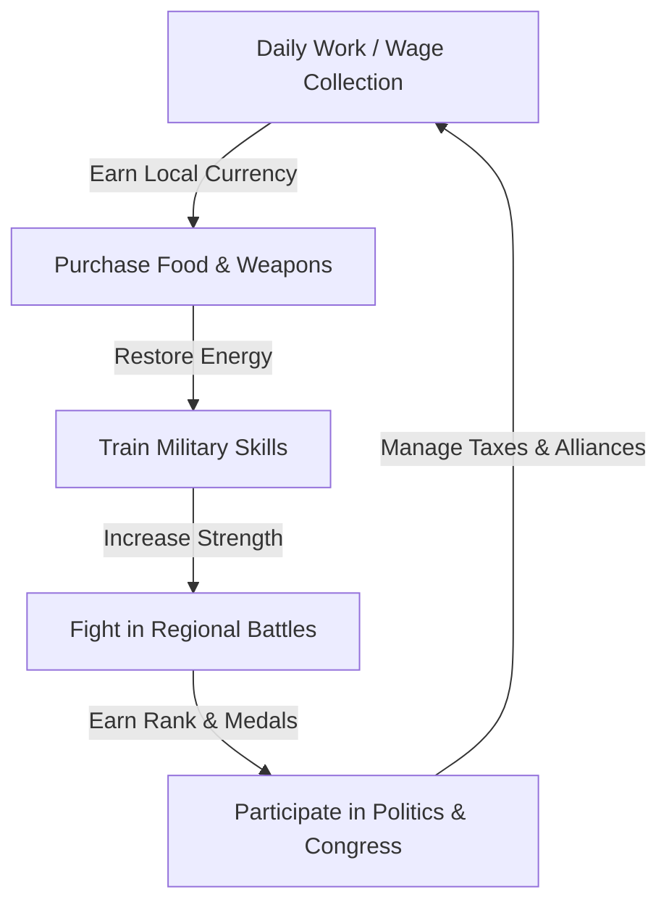

# 03 — Game Design Document (GDD)

## 1. The Core Gameplay Loop
The gameplay loop operates on a daily and weekly lifecycle, driving player interaction and collaboration.

## 2. Core Systems & Formulas

### A. Leveling and Experience (EXP)
Players gain experience by working, training, and fighting.
$$\text{Required EXP for Level } L = L^2 \times 100$$
*   **Work Reward**: $+10\text{ EXP}$, $+0.1\text{ Work Skill}$
*   **Train Reward**: $+10\text{ EXP}$, $+0.1\text{ Strength}$
*   **Fight Reward**: $+2\text{ EXP}$ per hit, $+0.05\text{ Military Rank}$

### B. Company Productivity
The amount of items produced when a player works is calculated as:
$$\text{Productivity } P = \text{Base} \times (1 + \text{Player Work Skill} \times 0.05) \times \text{Region Resource Abundance} \times \text{Company Infrastructure Level}$$
*   **Base Resource Values**: Q1 Raw Factory produces 10 Iron/Grain per work.
*   **Region Abundance**: High (1.5x), Medium (1.0x), Low (0.5x).

### C. Combat Damage Formula
The amount of damage/influence a player contributes to a battle wall is:
$$\text{Damage } D = 10 \times \left(1 + \frac{\text{Strength}}{100}\right) \times \text{Weapon Damage Modifier} \times \text{Military Rank Modifier}$$
*   **Weapon Quality**:
    *   Q0 (Unarmed): 1.0x modifier
    *   Q1 Weapon: 1.2x modifier, durability loss 1
    *   Q5 Weapon: 2.0x modifier, durability loss 1
*   **Rank Modifier**: Starts at 1.0x, increases by 0.02x per rank (e.g., General rank = 1.5x).

## 3. Economy & Taxes

### Trade Taxes
When a player sells goods on the marketplace, the country owning the region takes a cut based on the local tax rate set by Congress:
$$\text{Tax Deducted} = \text{Sale Price} \times (\text{VAT} + \text{Import Tax})$$
*   **VAT**: Levied if the seller is a domestic citizen.
*   **Import Tax**: Levied if the seller is a foreign company exporting goods.

### Currency Forex
The exchange market allows players to place bid/ask contracts trading **Gold** (global currency) for local national currencies. This operates on a double auction model.

## 4. Geopolitics & Wars
*   **Battle Duration**: 24 hours divided into 2-hour mini-campaigns.
*   **Victory Condition**: Win 8 out of 15 rounds.
*   **Congress Proposer**: Proposing a war costs national gold reserves, which are managed by the elected President.
