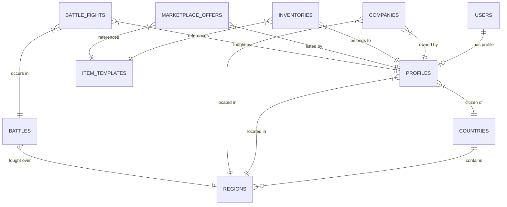

# 05 — Database Design

## 1. Schema Diagram Overview

## 2. Core Tables Schema Definition

### Table: `profiles`
Tracks player stats, resources, and geography.
*   `id`: `uuid` (Primary Key, references `auth.users`)
*   `username`: `varchar(30)` (Unique, Indexed)
*   `citizenship_country_id`: `integer` (Foreign Key -> `countries`)
*   `current_region_id`: `integer` (Foreign Key -> `regions`)
*   `gold`: `numeric(12, 4)` (Default: 0.0000)
*   `local_balance`: `numeric(12, 2)` (Default: 100.00)
*   `energy`: `integer` (Constraint: $0 \le \text{energy} \le 100$)
*   `strength`: `numeric(10, 4)` (Default: 1.0000)
*   `work_skill`: `numeric(10, 4)` (Default: 1.0000)
*   `level`: `integer` (Default: 1)
*   `experience`: `bigint` (Default: 0)
*   `last_work_at`: `timestamp with time zone`
*   `last_train_at`: `timestamp with time zone`
*   `created_at`: `timestamp with time zone`

### Table: `countries`
*   `id`: `integer` (Primary Key)
*   `name`: `varchar(50)` (Unique)
*   `president_id`: `uuid` (references `profiles`)
*   `gold_reserve`: `numeric(16, 4)`
*   `local_currency_reserve`: `numeric(18, 2)`
*   `vat_rate`: `numeric(4, 2)`
*   `import_tax_rate`: `numeric(4, 2)`

### Table: `regions`
*   `id`: `integer` (Primary Key)
*   `name`: `varchar(50)`
*   `country_id`: `integer` (references `countries`)
*   `resource_type`: `varchar(20)` (e.g., 'grain', 'iron', 'oil')
*   `resource_abundance`: `numeric(3, 2)` (e.g., 1.00 = 100%)

### Table: `item_templates`
Data-driven catalog of items.
*   `id`: `integer` (Primary Key)
*   `name`: `varchar(50)`
*   `description`: `text`
*   `type`: `varchar(20)` (e.g., 'food', 'weapon', 'ticket')
*   `base_value`: `numeric(10, 4)`

### Table: `inventories`
*   `id`: `uuid` (Primary Key)
*   `owner_id`: `uuid` (references `profiles`)
*   `item_template_id`: `integer` (references `item_templates`)
*   `quantity`: `integer` (Constraint: $\ge 0$)
*   `quality`: `integer` (1 to 5)

## 3. Database Security (Row Level Security - RLS)
We apply strict PostgreSQL RLS rules:
*   `profiles`: Read access: `public`. Write access: `auth.uid() = id`.
*   `inventories`: Read access: `auth.uid() = owner_id`. Write access: restricted to internal trigger procedures.
*   `marketplace_offers`: Read access: `public`. Write/Insert: `auth.uid() = seller_id`.

## 4. Indexing & Partitioning Strategy
To scale to millions of rows, we implement:
1.  **Partitioning**: The `battle_fights` table (highly dynamic log table) is horizontally partitioned by month using PostgreSQL declarative partitioning.
2.  **Indexes**:
    *   Composite index on `inventories(owner_id, item_template_id, quality)` to speed up inventory lookups.
    *   Index on `marketplace_offers(item_template_id, price)` to optimize market list render operations.
